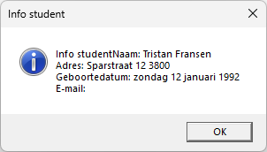
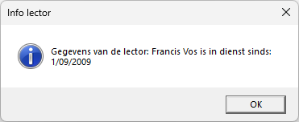

Maak een toepassing om de gegevens van *studenten*, *lectoren* of je eigen *persoonlijke* *gegevens* op te vragen.

***Leeg venster***

***Studenten overzicht***

***Lectoren overzicht***

De toepassing maakt gebruik van een bestanden *studenten.csv* en *lectoren.csv* waarin de studentengegevens en de gegevens van de lectoren zijn opgenomen.

Hieronder zie je een stuk van **studenten.csv** waarin de volgende kolommen zijn opgenomen:
- Name
- FirstName
- Street
- Zipcode
- Paid: J of N
- DepartmentCode: SNE, PRO, DVG en IOT. De codes bevatten achtereenvolgens de afdelingen: Systemen en netwerken, Programmeren, Digitale vormgeving en Internet of things.
- StudentType: G of I waarbij G een gewone student is die een normaal traject volgt en I een student is met een individueel traject.
- StudyPoints die enkel voor studenten met een individueel traject voorkomen.

Het bestand lectoren.csv bevat de volgende kolommen:
- Name
- FirstName
- BirthDate
- Street
- Zipcode
- Statute: DT of FT (deeltijds of fulltime)
- DepartmentCode: SNE, PRO, DVG en IOT. De codes bevatten achtereenvolgens de afdelingen: Systemen en netwerken, Programmeren, Digitale vormgeving en Internet of things.
- InService: startdatum dat de lector begonnen is.

We vertrekken vanuit de klasse `Person`. De klassen `Lector` en `Student` erven de basiseigenschappen en methods over. Daarnaast maken we ook gebruik van 2 statische klassen `FileImport` en `Validator`.

**Klasse Person**

In bovenstaande klasse diagram zie je de eigenschappen terug.

De eigenschap **Data** moet overgeërfd kunnen worden en geeft de FullName() en BirthDate (lange datumnotatie).
De functiemethode **FullName**() geeft voornaam en naam terug. Deze moet men ook kunnen overerven.
De void-method **Info(string tekst)** geeft een berichtenvenster terug met de persoonlijke gegevens.

In de lege constructor **Person()** kan je je persoonlijke gegevens toekennen. Het e-mailadres wordt wel ingelezen uit het tekstvak **EmailTextBox.** Hierbij wordt gebruik gemaakt van de klasse Validator om het tekstvak te testen.

**Klasse Validator**

Deze statische klasse bevat 2 methods om te testen of het tekstvak EmailTextBox niet leeg is/correct is vooraleer je het e-mailadres doorgeeft aan de eigenschap Email uit de klasse Person.

De booleaanse functiemethod **IsPresent(tekstvak)** controleert of het tekstvak niet leeg is. Geeft *False* wanneer het tekstvak leeg is en *True* wanneer er gegevens zijn.
De booleaanse functiemethod **IsValidEmail(tekstvak)** controleert of er in de gegevens een '@' en '.' aanwezig. Geeft *False* wanneer het e-mailadres foutief is en *True* wanneer het e-mailadres correct is.

**Klasse FileImport**

Deze statische klasse bevat 2 functiemethoden die beiden een List teruggeven.

**ReadLector(string fileName)** leest het bestand *lectoren*.*csv* in en geeft een List\<Lector\> terug.

**ReadStudent(string fileName)** leest het bestand *studenten*.*csv* in en geeft een List\<Student\> terug.

Voor beide methods geldt dat je er een FileNotFoundException wordt gegenereerd wanneer het bestand niet bestaat.

**Klasse Student**

De klasse bevat bijkomende eigenschappen:
- StartDate: huidige dag
- Paid: J of N
- StudentType: I of G
- Course: SNE, PRO, DVG of IOT
- StudyPoints: moeten tussen 0 en 99 liggen
- SubscriptionAmount: voor de gewone student is dit € 520 en voor de individuele trajecten bedraagt het 50 + (8.66667 \* studiepunten)
- Overgeërfde eigenschap Data die de eigenschap FullName() uit klasse Person + StudentType + Betaald + Inschrijvingsbedrag geeft.

De klasse bevat eveneens een aantal methods:

- Overgeërfde void-method **Info(string tekst)** die onderstaande info teruggeeft.

- **PrintStartdate():** geeft eigenschap FullName() uit klasse Person + Startdatum
- **AfdrukAdres():** geeft FullName() uit klasse Person + Straat + Postcode
- Over te erven **ToString():** Geeft bij StudentType = I onderstaande boodschap

> 

en bij StudentType = G de volgende boodschap:

> 

- Constructor Student() dat de huidige datum aan de Startdatum toekent.

**Klasse Lector**

De klasse bevat bijkomende eigenschappen:
- Statute: DT of FT (deeltijds of fulltime)
- Department: ontvangt SNE, PRO, DVG of IOT maar geeft de volledige afdelingsnaam terug (Systemen en netwerken, Programmeren, Digitale vormgeving en Internet of things).
- InService: startdatum dat de lector begonnen is.
- Overgeërfde eigenschap Data die de eigenschap FullName() uit klasse Person + Statuut + Afdeling geeft.

De klassen bevat eveneens een aantal methods:
- Overgeërfde void-method **Info(string tekst)** die onderstaande info teruggeeft.

> 

- **PrintInService():** geeft eigenschap FullName() uit klasse Person + "is in dienst sinds: " + InService (kort datumnotatie)
- **PrintAddress():** geeft FullName() uit klasse Person + Straat + Postcode
- Over te erven **ToString():** Geeft bij Statuut = FT onderstaande boodschap

> 

en bij Statuut = DT de volgende boodschap:

> 
